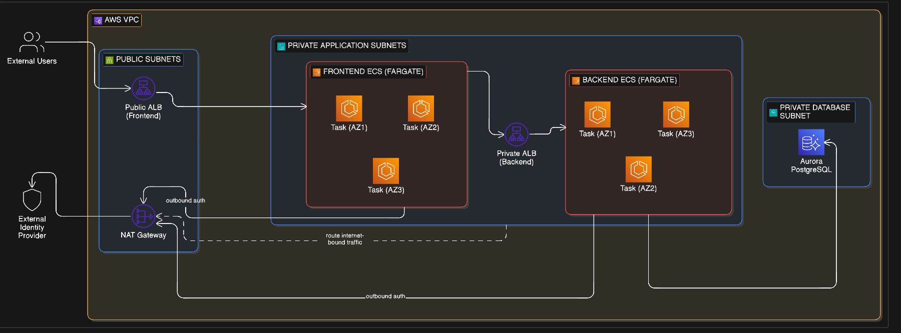

# Atelier

A simple e-commerce backend API with product catalog, user carts, and order placement features.

## Project Purpose

This project was created as a means to learn DevOps practices, specfically:
- Containerization (via Docker)
- Continuous Integration / Continuous Delivery (CI/CD)
- Infrastructure as Code (via Terraform)
- Security Scanning (via Trivy)

And how each of these components fit within the application delivery pipeline to provide rapid secure, and robust application feature deployments.

## Tech Stack

Atelier's tech stack includes:

- NestJS
- Terraform
- Docker
- GitHub Actions
- Python

## Architecture Overview

### AWS Services Used

#### Compute & Container Service

- ECS Fargate
- ECS Service (with App Auto-scaling)

#### Networking

- **Virtual Private Cloud:** to provide isolated networking to the application
- **Public subnets:** for internet facing resources
- **Private subnets:** for application and database & security
- **Internet gateway:** allows public internet access to the VPC
- **NAT Gateway:** allows outbound internet access to private containers (to DockerHub, Auth0, etc.)

#### Database

- **Amazon Aurora Serverless:** Aurora Serverless was used over RDS due to its cost-effectiveness
in development environments. Multi-AZ failover was not implemented due to cost being a major constraint in this project.

#### Observability

- **CloudWatch Logs:** application and container logs. The logs were also used for debugging
issues with the containers deployed.

#### Security

- **Security Groups:** to provided isolation between services within the VPC

### Service Communication

- Inbound internet access happens through the Internet Gateway into the VPC.
- The traffic gets routed to an Application Load Balancer (ALB) which then routes traffic to 
the API ECS Service containers.
- The API containers communicate externally with Auth0 to provide user authentication via the NAT
Gateway.
- THe API containers also communicate with the Aurora Database to provide user requested data.

## Infrastructure

- Terraform (OpenTofu) was used to create the application infrastructure for reproducibility.
- The IaC folder is split into several modules (compute, network, database) due to isolated concerns.

### Key Architecture Decisions

- A single NAT Gateway was used instead of three (1 per AZ) for high availability, due to cost
considerations. In a production environment, either a regional NAT Gateway or a NAT Gateway per AZ
used in the application architecture, would be recommended.

- A single-AZ Aurora database was used due to cost considerations. In a production environment, a
multi-AZ deployment with an additional database for failover is recommended.

### Deploying the Infrastructure

To deploy the application architecture, a number of environment / repository secrets are required:

- DockerHub username
- DockerHub access token
- AWS IAM role to provide the CI/CD pipeline with the necessary permissions to access AWS via OIDC.
- A database username
- A strong database password
- An Auth0 domain
- An Auth0 API audience

## CI/CD

(in progress)