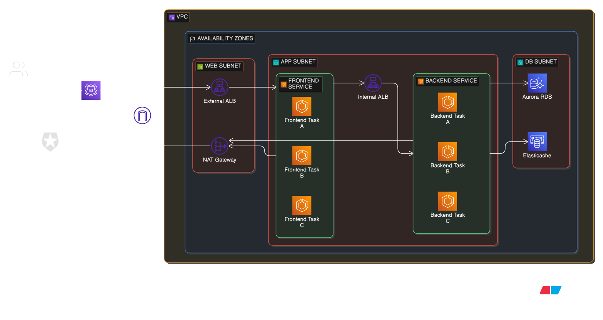
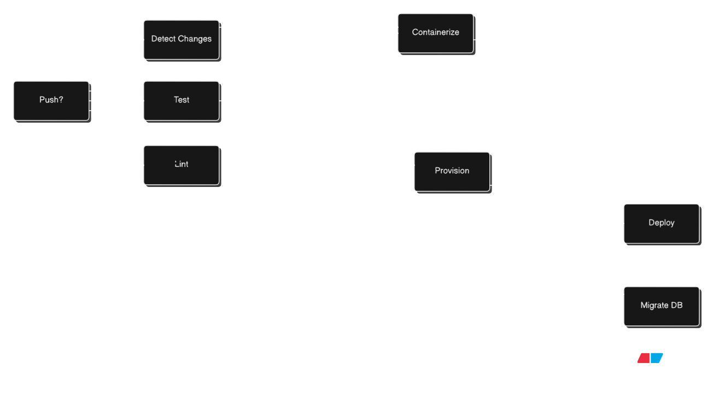

<!-- omit from toc -->
# Atelier - 3 Tier Web Architecture with CI/CD Integration
<!-- omit from toc -->
## Project Overview
This project involves building and deploying a 3-tier e-commerce web application on AWS to provide scalability. OpenTofu is used to create the infrastructure, and GitHub Actions is used to test the application code, build container image artifacts, and deploy to AWS.

This repository serves as a Personal DevOps Lab for experimenting with various AWS architectural patterns, automation workflows, and infrastructure best practices.

---
<!-- omit from toc -->
## Table of Contents
- [Tech Stack](#tech-stack)
- [Architecture Overview](#architecture-overview)
- [Design Principles \& Architecture](#design-principles--architecture)
  - [Traffic Routing \& Load Balancing](#traffic-routing--load-balancing)
  - [Network Segmentation (Subnet Strategy)](#network-segmentation-subnet-strategy)
  - [Network Security (Least Privilege)](#network-security-least-privilege)
  - [Service \& Data Design](#service--data-design)
- [Infrastructure as Code (IaC)](#infrastructure-as-code-iac)
- [CI/CD Pipeline](#cicd-pipeline)
  - [Smart Workflow Orchestration (Path Filtering)](#smart-workflow-orchestration-path-filtering)
  - [Container Lifecycle \& Optimization](#container-lifecycle--optimization)
  - [Database Migration Strategy](#database-migration-strategy)
- [Deployment \& Usage](#deployment--usage)
- [Observability](#observability)
- [Case Studies (Lab Roadmap)](#case-studies-lab-roadmap)

## Tech Stack
- **Backend**: NestJS
- **Infrastructure**: OpenTofu
- **Containerization**: Docker
- **CI/CD**: GitHub Actions
- **Scripting**: Python

## Architecture Overview
As displayed in the diagram, Atelier is deployed on ECS Fargate and connects to Aurora RDS. Elasticache acts as the data store for user session data, and Route 53 provides DNS access to the application.

---

## Design Principles & Architecture
### Traffic Routing & Load Balancing
The architecture utilizes a dual-ALB strategy to decouple the presentation and application layers while maintaining internal network privacy.

- **External ALB**: Acts as the entry point for all user traffic, listening on port 80. It handles public requests and routes them to the Frontend ECS service on port 3000.

- **Internal ALB**: Facilitates service-to-service communication. It listens on port 5000, routing requests from the Frontend to the Backend API. This setup provides a simple, scalable alternative to Service Discovery while allowing for independent scaling of each tier.

- **Port Strategy**: Services are standardized on port 5000 for internal traffic, ensuring consistency across the application logic.

**Configuration**: [View Load Balancer Definitions](./infra/load-balancers.tf)

### Network Segmentation (Subnet Strategy)
The VPC is divided into three distinct functional layers across multiple Availability Zones to ensure resource isolation:

- **Web Subnets (Public)**: Houses the External Application Load Balancer and the NAT Gateway. These are the only subnets with a direct route to the Internet Gateway (IGW).

- **App Subnets (Private)**: Houses the Frontend and Backend ECS Fargate tasks, as well as the Internal ALB. These subnets route outbound traffic through the NAT Gateway in the Web tier.

- **DB Subnets (Private)**: A dedicated, isolated layer for stateful resources, including Amazon Aurora Serverless and Valkey (ElastiCache). These subnets have no outbound internet route and no direct public access.

**Configuration**: [View VPC & Subnet Networking](./infra/vpc.tf)

### Network Security (Least Privilege)
Isolation is strictly enforced through a "chained" Security Group architecture. Each layer only accepts traffic from the layer immediately preceding it:

- **Web Tier**: The External ALB security group allows 80/443 from the internet. The Frontend security group only accepts traffic from the External ALB.

- **App Tier**: The Internal ALB security group only accepts traffic from the Frontend security group. The Backend security group only accepts traffic from the Internal ALB.

- **Data Tier**: Aurora RDS and Valkey (ElastiCache) security groups only accept traffic from the Backend security group and have no outbound internet access.

- **Egress**: A NAT Gateway residing in a public subnet provides controlled outbound access for the Frontend and Backend tasks (required for external integrations like Auth0).

**Configuration**: [View Security Group Rules](./infra/security-groups.tf)

### Service & Data Design
- **Compute**: The Frontend and Backend are deployed as separate ECS Services within a single ECS Cluster. This minimizes management overhead while allowing independent deployment cycles and auto-scaling policies for each microservice.

- **Stateful Services**:
  - **Aurora Serverless**: Provides the primary relational data store.

  - **Valkey (ElastiCache)**: Currently utilized for high-performance session management (Carts), with a roadmap to expand into general query caching.

**Configuration**:
  - [View ECS Resources](./infra/ecs-cluster.tf)

  - [View Database Resources](./infra/database.tf)

---

## Infrastructure as Code (IaC)
(Details regarding the flattened OpenTofu structure and state management here.)

---

## CI/CD Pipeline
This project uses a monorepo pipeline powered by GitHub Actions and Turborepo. The pipeline is designed to be "change-aware," ensuring that only modified services are built and deployed, saving significant time and compute resources.

  

  ### Smart Workflow Orchestration (Path Filtering)
  The pipeline uses a `detect-changes` stage to analyze the commit. This stage determines if the api, web app, infrastructure, or database migrations require action.

  - **Matrix Strategy**: If both the `api` and `web` apps are changed, GitHub Actions launches parallel `containerize` and `deploy` jobs for each, significantly reducing the total runtime.

  - **Infrastructure Sync**: The `provision` job ensures the AWS environment matches the OpenTofu configuration before any application deployment occurs.

  ### Container Lifecycle & Optimization
  - **Turborepo Pruning**: To keep Docker images lean, the pipeline uses `turbo prune --docker`. This extracts only the relevant workspace packages and local dependencies required for the specific component being built.

 - **Secure Authentication**: The pipeline uses AWS OIDC (OpenID Connect). This allows GitHub Actions to assume a specific IAM role via a short-lived token, eliminating the need for long-lived AWS Access Keys. See [Configuring OIDC in AWS](https://docs.github.com/en/actions/security-for-github-actions/security-hardening-your-deployments/configuring-openid-connect-in-amazon-web-services)

  - **Tagging Strategy**: Images are currently tagged with both the Git SHA (for traceability) and latest (for ECS deployment).

  ### Database Migration Strategy
  Migrations are handled via a decoupled workflow to ensure data schema consistency before the new application code goes live.

  - **Mechanism**: The pipeline utilizes the existing API Docker image but overrides the Entrypoint.

  - **Execution**: A one-off ECS Task is spun up to execute the migration logic and is automatically terminated upon completion. This ensures migrations run in an environment identical to the production API.

---

## Deployment & Usage
(Prerequisites, environment variables/secrets, and the commands required to deploy or destroy the stack here.)

## Observability
(How to verify the deployment via endpoints and where to find logs/metrics here.)

## Case Studies (Lab Roadmap)

- Case Study 1: High Availability & Multi-AZ Failover (Planned)

- Case Study 2: Redis Performance & Failover (Planned)

- Case Study 3: S3 & CloudFront Integration (Planned)

- Case Study 4: Security Hardening & Observability (Planned)