# Case Study 1: GitHub Actions OIDC Least Privilege

## Introduction

Prior to doing this case study, I looked up setting up OIDC (or OpenID Connect) with GitHub Actions. Since I'm coming from a security background, it didn't really sit right with me to upload my Access Keys to a public repository (even if they were set as secrets).

According to the GitHub Actions [docs](https://docs.github.com/en/actions/security-for-github-actions/security-hardening-your-deployments/configuring-openid-connect-in-amazon-web-services) there are alternatives to using AWS Access Keys directly in a repository. So I went with that approach.

This case study isn't about setting up OIDC. Rather, it's about tightening the permissions that my CI/CD pipeline's role has in my deployment environment. So let me walk you through what I'll be doing.

At the time of writing this, my OIDC role for this repo's pipeline is using admin access. here's a snippet of the role:

```yaml
CICDRole:
  Type: AWS::IAM::Role
  Properties:
    AssumeRolePolicyDocument:
      Version: "2012-10-17"
      Statement:
          - Effect: Allow
            Action: "sts:AssumeRoleWithWebIdentity"
            Principal:
              Federated: !GetAtt GitHubActionsOIDCProvider.Arn
            Condition:
              StringEquals: 
                "token.actions.githubusercontent.com:aud": "sts.amazonaws.com"
                "token.actions.githubusercontent.com:repository": !Sub "${GitHubRepository}"
                "token.actions.githubusercontent.com:ref": "refs/heads/main"
              StringLike:
                "token.actions.githubusercontent.com:sub": !Sub "repo:${GitHubRepository}:*"
    ManagedPolicyArns:
      - arn:aws:iam::aws:policy/AdministratorAccess
```

You can find the role in [`bootstrap.yaml`](../../../bootstrap.yaml). And as you can see, we're using AdministratorAccess. Really, really bad for security, but I used it to verify that my pipeline and application were working, and so that I could practice how to determine the least permissions I needed to make this pipeline work. That's what this case study is for after all.

## Approach

Okay, let's talk about the approach we are going to be using. AWS provides us with some services that we can take advantage of:

1. **CloudTrail:** logs every API call that you make to AWS. Creation, destruction, updates, and much more. Since OpenTofu uses API calls to AWS to create the infrastructure defined within it, we can use CloudTrail to identify all of the API calls that our CI/CD pipeline needs.

2. **AWS IAM Policy Generator:** allows us to generate a policy based on CloudTrail activity.

So these are the services that we will be using for this case study. Let's begin.

## Walkthrough

### Step 1: Create a CloudTrail Trail to Track Pipeline Activity

The first thing we need to do is to create a trail in CloudTrail. IAM policy generator expects that we have a trail, so that it can simply extract information from the trail.

So let's do that in the console:

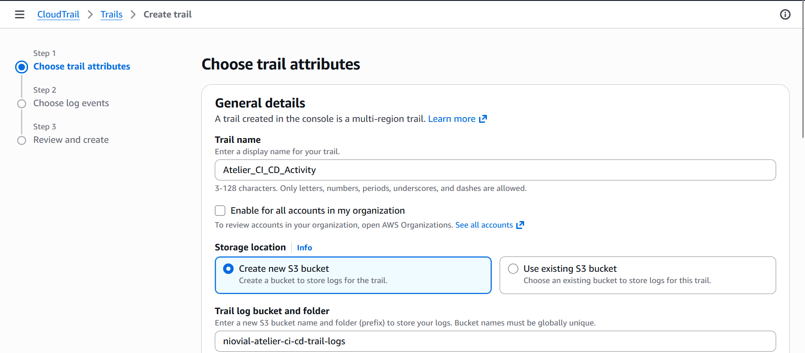

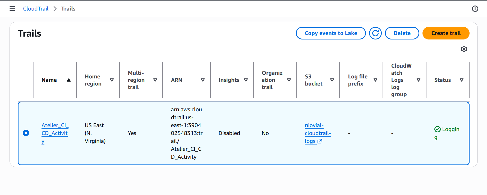

### Step 3: Generate API Events via CI/CD Pipeline

Now that we are done with creating the role, we need to generate some events for the trail to capture.
To do that, we can run the CI/CD pipeline and generate some events with the admin access that the pipeline has. This will allow the policy generator to see the exact permissions required.

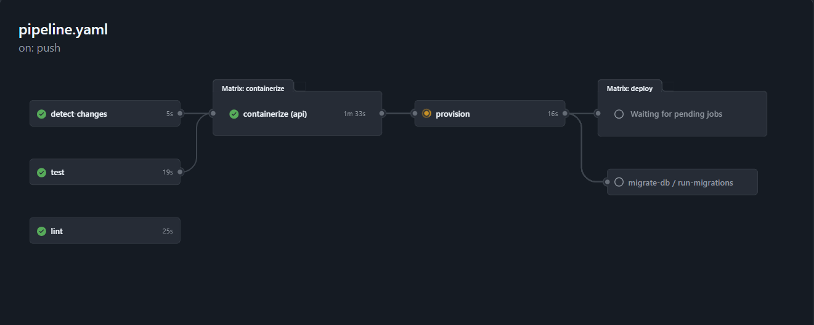

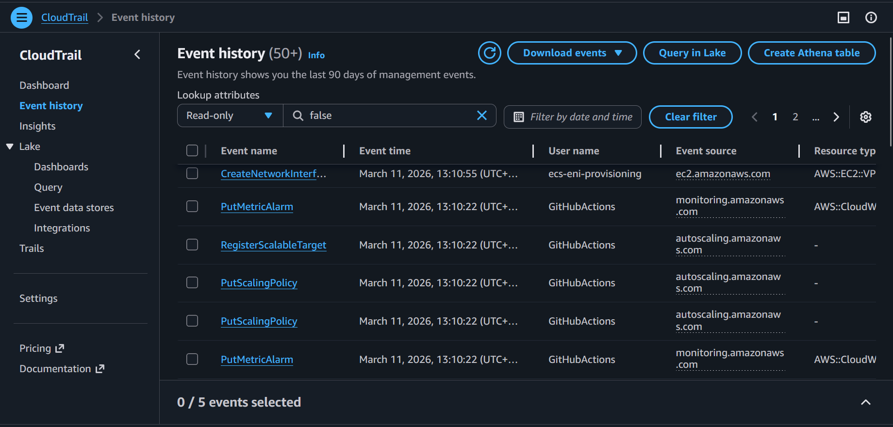

Okay. So now that we have generated events using our pipeline it's time to move on to the next step.

### Step 4: Enable Policy Generation on the CI/CD IAM Role

AWS provides a feature within IAM Roles that enables you to create a permissions policy for an IAM Role based on the usage of the role logged within CloudTrail Events. So let's enable that:

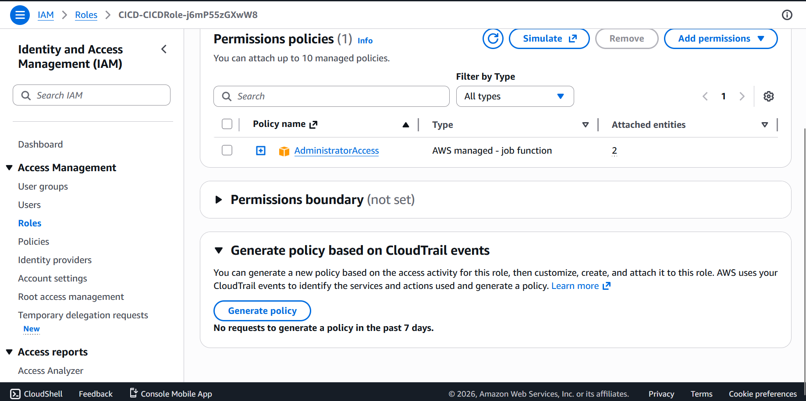

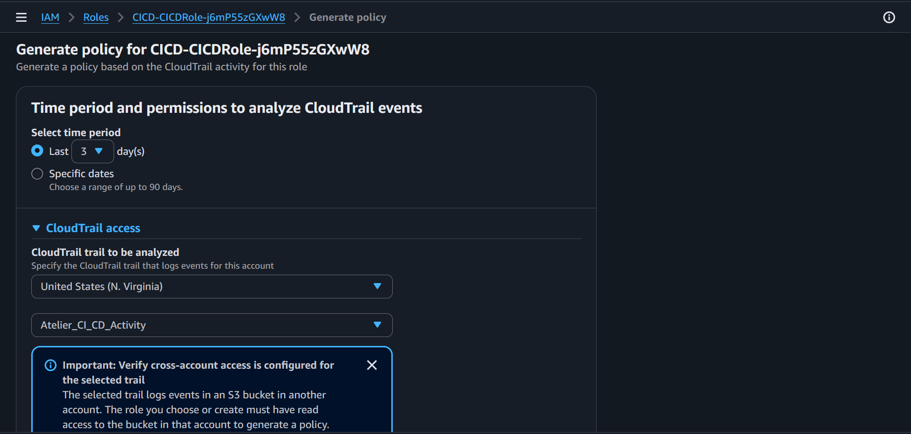

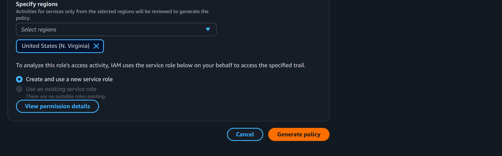

### Step 5: Review the Generated Policy

So our policy has now been generated:

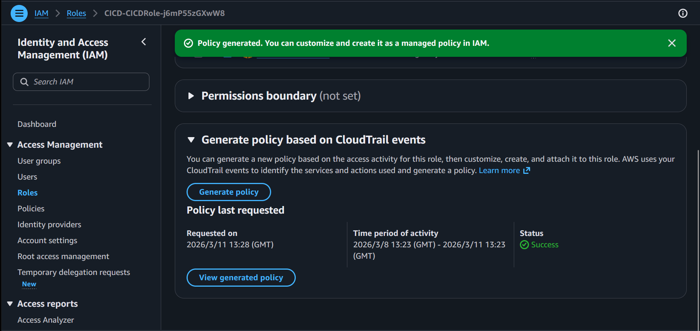

And now we have to review the policy. There are a lot of permissions that this role uses, so we won't include all of them here in a screenshot:

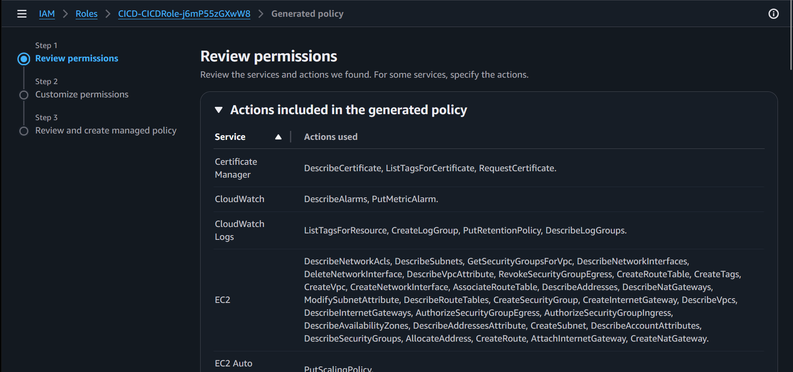

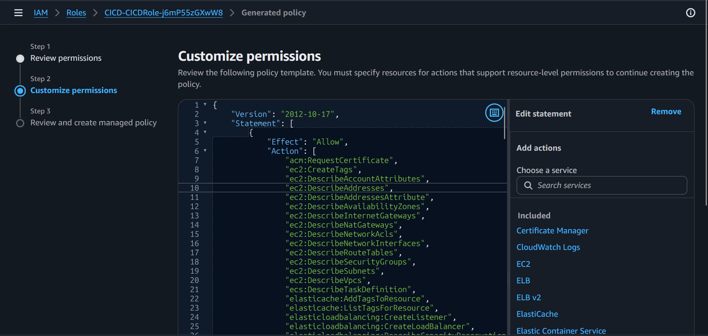

As we can see, the policy generator did a lot of work. We were able to generate a policy instead of having to manually write out the permissions ourselves. Now, there are a few things I want to do to make managing these permissions easier, because there are a lot of them. I need to refine and segregate these policies. What I plan on doing is going for separating them into:

- Compute Policy
- Database Policy
- Networking Policies
- Security, Identity, & Compliance Policy

Well, that's the idea anyway. I'm not necessarily going to stick to the exact structure I just stated above, but at least you get the idea. Instead of keeping them in JSON, I'll add them to `bootstrap.yaml` so that we can reproduce these permissions whenever we need to.

### Step 6: Refine and Segregate the Generated Policy

For historical reasons, I'll keep the full generated policy within my repo, so that you can see where we started, and where we ended. You can access the policy [here](/CI_CD_Role_Policy.json).

Now, let's move on to segregating the policy. Rather than reproducing the full policy here in CloudFormation , youc can find the complete implementation in [`bootstrap.yaml`](/bootstrap.yaml). Let's walk through the decisions made during the segregation process.

The first thing I want to establish is that I'm not restructuring what AWS generated. The policy generator already did the hard work of scoping actions to the correct resource types. My job here is purely organization — grouping statements into logical managed policies that are easier to read, audit, and maintain.

#### Network Policy

Discovery actions are collapsed into `ec2:Describe*` and `ec2:Get*` on `Resource: "*"`, which covers the full surface area of read operations OpenTofu needs during its plan phase. Mutating actions are wildcarded as `ec2:*` but scoped to specific resource type ARNs: VPCs, subnets, route tables, security groups, internet gateways, NAT gateways, network interfaces, and elastic IPs.

There is also a dedicated tagging statement using `ec2:CreateTags` scoped to `arn:...:ec2:region:account:*/*`, covering all EC2 resource types within the account since tagging happens across resource types, not just networking ones.

#### Compute Policy

The compute policy follows the same pattern as the network policy. Discovery actions for ECS, CloudWatch, Auto Scaling, and CloudWatch Logs are collapsed into `Describe*` and `List*` wildcards on `Resource: "*"`. Mutating actions are wildcarded per service, `ecs:*`, `logs:*`, `application-autoscaling:*`, `autoscaling:*`, and `cloudwatch:*`, each scoped to their respective resource ARNs.

#### Load Balancer Policy

Discovery actions are collapsed into `elasticloadbalancing:Describe*` on `Resource: "*"`. Creation actions (`CreateLoadBalancer`, `CreateListener`, `CreateTargetGroup`) were kept explicit on `Resource: "*"` since load balancer ARNs don't exist prior to creation. All other mutating actions were wildcarded as `elasticloadbalancing:*` scoped to load balancer, target group, and listener ARNs.

#### Security And Identity Policy

This is the one policy that I deliberately kept conservative. Because it covers ACM, IAM, KMS, Secrets Manager, and SSM, all sensitive services, i made sure that mutating actions were kept explicitly listed rather than wildcarded. Discovery actions were alse scoped as tightly as AWS allows: some services like ACM and KMS require `Resource: "*"` for their list/describe calls, while Secrets Manager and SSM parameters are scoped to the `/atelier/` path prefix. The one addition beyond the original generated policy is `acm:DeleteCertificate`, which is needed for destroy operations.

One important note: secrets, SSM parameters, and KMS keys are all managed by CloudFormation via `bootstrap.yaml`, not by OpenTofu. So OpenTofu only needs read access to these resources, not the ability to create or delete them. I reflected this in the policy.

#### DNS And Storage Policy

S3 access is consolidated to the Terraform state bucket only — the original generated policy had a broad `s3:GetObject` on `Resource: "*"` which has been tightened here. Route 53 discovery is collapsed into `List*` and `Get*` wildcards on `Resource: "*"`. Since OpenTofu only manages records within an existing hosted zone and never creates or destroys zones themselves, `ChangeResourceRecordSets` is the only mutating action I needed to add.

### Step 7: Testing the Policy

Okay. Now that we have "narrowed" down the actions my CI/CD role can make, it's time to test the pipeline to see if it succeeds or fails in deployment.

First, we need to create a change set in CloudFormation to update the current permissions.

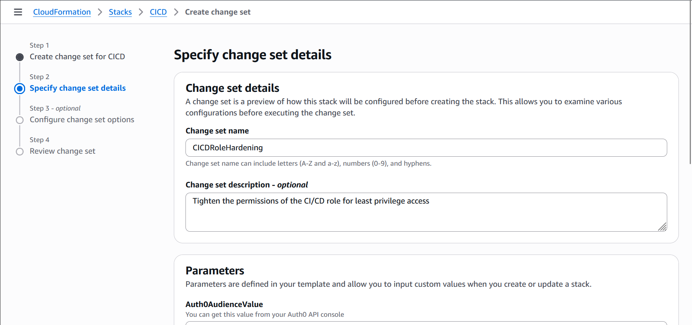

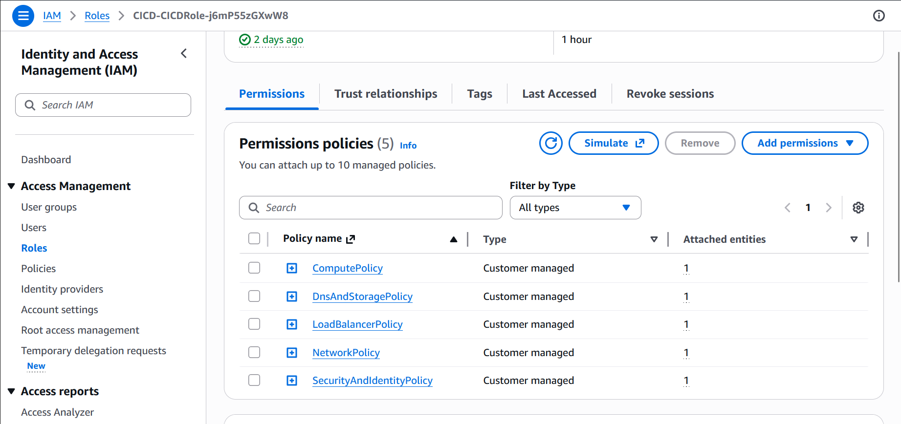

Next, we need to actually run the pipeline to see if it will be able to successfully provision the resources.

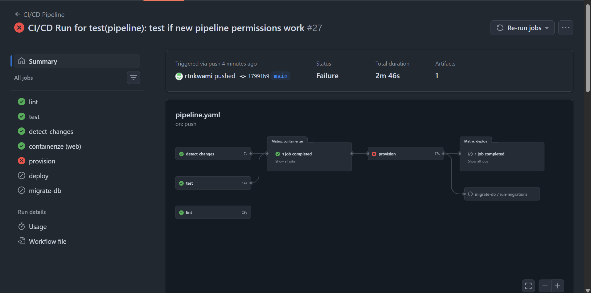

As shown in the picture above, the pipeline failed. Now we need to diagnose the reason why. Thankfully, it gives us a very helpful error message:

`api error AccessDenied: User: arn:aws:sts::[redacted]:assumed-role/CICD-CICDRole-j6mP55zGXwW8/GitHubActions is not authorized to perform: s3:ListBucket on resource: "arn:aws:s3:::generic-s3bucket-name" because no identity-based policy allows the s3:ListBucket action`

So, I made a mistake! I forgot to include the permissions to access to Terraform state bucket. Let's add that and retry the pipeline.

```yaml
- Sid: TerraformStateBucketAccess
  Effect: Allow
  Action:
    - "s3:GetObject"
    - "s3:PutObject"
    - "s3:DeleteObject"
    - "s3:ListBucket"
  Resource:
    - !Sub "${TerraformStateBucket.Arn}"
    - !Sub "${TerraformStateBucket.Arn}/*"
```

That should have been straightforward enough. But it wasn't. This is where things got frustrating.
Over the next several hours, the pipeline failed 13 more times. Each failure meant reading the error message, identifying the missing permission, updating the policy, deploying the change set, and running the pipeline again — only to hit a different missing permission. Rinse and repeat.

The core problem was that the IAM Policy Generator could only capture permissions that were actually called during the observation window. OpenTofu, however, calls a much wider surface area of AWS APIs than what any single pipeline run exposes — especially during the plan phase, where it issues a large number of `Describe` and `List` calls to reconcile desired state with actual state. Some of these were never exercised during the window I used for generation, so they never made it into the policy.

After 13 failures and several hours of iteration, it became clear that continuing to chase individual missing permissions was not a viable strategy. The generated policy was a good starting point, but it was too rigid and too granular to hold up against the full breadth of what OpenTofu needs.
So I stepped back and reconsidered my approach entirely. Rather than writing down every individual action, I settled on a strategy using wildcards:

- Discovery actions (Describe, List, Get) should be wildcarded at the action level (e.g.  `ec2:Describe* `) on `Resource: "*"`. These are read-only and carry minimal security risk.

- Mutating actions (Create, Modify, Delete, etc.) should be wildcarded at the service level (e.g. `ec2:*`) but scoped to specific resource type ARNs within my account and region. This covers any action OpenTofu might need without granting complete access across all of AWS.

- Sensitive services (IAM, KMS, Secrets Manager, SSM) should have their permissions kept explicitly listed with no wildcarding, since these are the areas where overly broad permissions carry real risk.

The result is a policy that is still significantly more restrictive than the original AdministratorAccess, but resilient enough that OpenTofu can do its job without hitting a wall every time it makes an API call that wasn't captured during policy generation.

And finally, the pipeline is working after many, many failures:

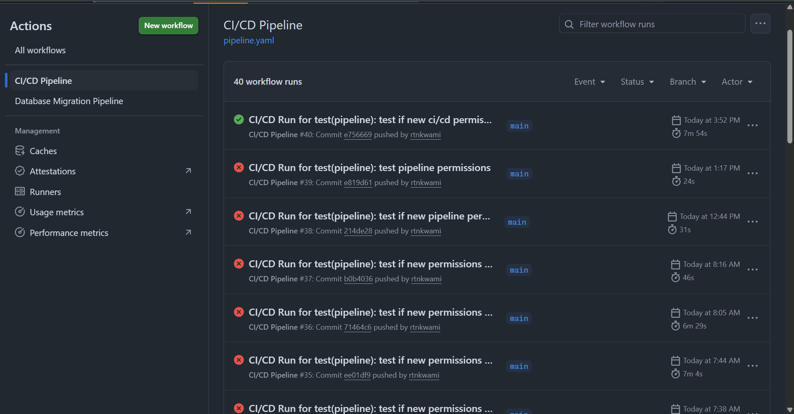